- [train-分析](#train-分析)

- model: path to model file, i.e. yolov8n.pt, yolov8n.yaml

- 所使用模型文件的位置
- .pt:从预训练模型的基础上进行训练
  - 若我们选择 `yolov8n.pt`这种.pt类型的文件，其实里面是包含了模型的结构和训练好的参数的，也就是说拿来就可以用，就已经具备了检测目标的能力了
  - `yolov8n.pt`能检测coco中的80个类别。假设你要检测不同种类的狗，那么`yolov8n.pt`原本可以检测狗的能力对你训练应该是有帮助的，你只需要在此基础上提升其对不同狗的鉴别能力即可。
  - 但如果你需要检测的类别不在其中，例如口罩检测，那么就帮助不大
- `.yaml`文件是从零开始训练。采用`yolov8n.yaml`这种.yaml文件的形式，在文件中指定类别，以及一些别的参数。
- 模型选择
  - 像 YOLOv8x 和 YOLOv8x6 这样较大模型几乎在所有情况下都会产生更好的结果，但参数量更大，需要更多的显卡内存来训练，并且运行速度更慢。

## Train 分析

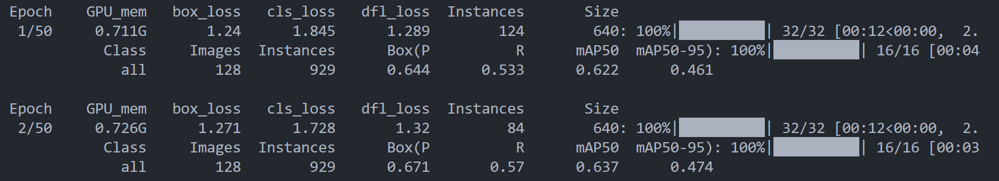

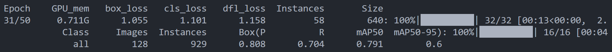

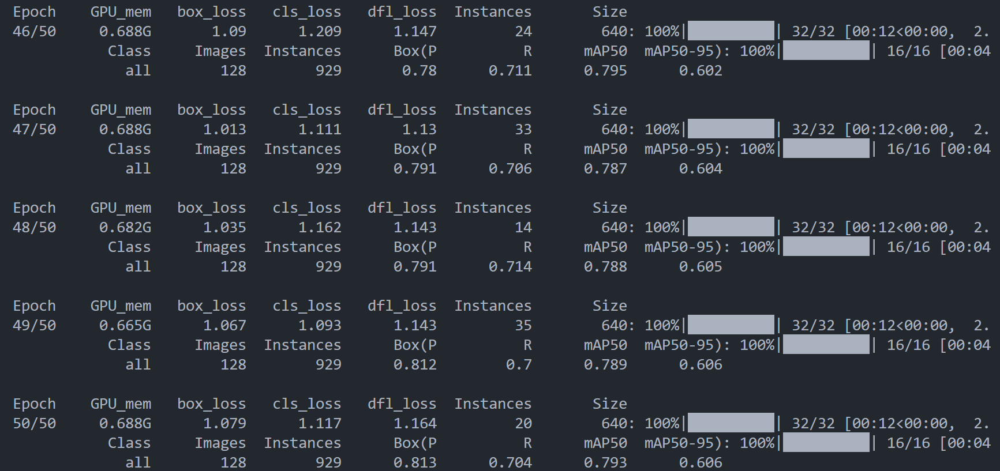

**Epoch：**迭代次数

**Gpu_men**：显卡显存占用,不超过最大显卡显存就好，如果超过可以调低batch。

**box_loss:** 边界框损失

**cls_loss:**分类损失

**dfl_loss:**特征点损失

**Instances：**实例个数，矩形框个数，这个数是在不断变化的

**Size：**640，训练时会将输入图像resize到640*640

**Class：**训练类

**Images：**训练图像数量，

**Instances：**全部矩形框个数

**Box（P：**精准率

**R：**召回率

**map50：置信度阈值在0.5时，检测的map**

**map50-95：**0.5 0.55 0.6 0.65 0.7 0.75 0.8 0.85 0.9 0.95，取得10个mAP值，然后对这十个值取平均。

**由图可知，map50，map是0.79，map50-95：map是0.6，说明在高阈值时，检测效果并不好，由0.7，0.75对称可得：大部分检出框置信度在0.5~0.8之间。**

## P-R曲线 精准率 召回率

## 查看train result

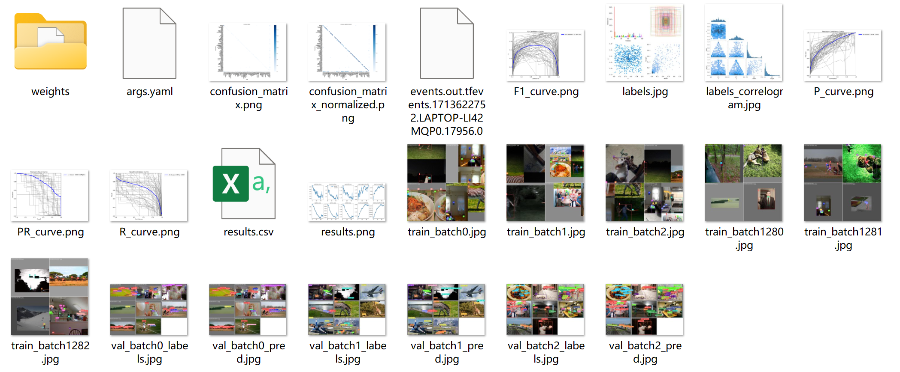

- confusion_matrix 混淆矩阵

- F1 curve F1置信度

  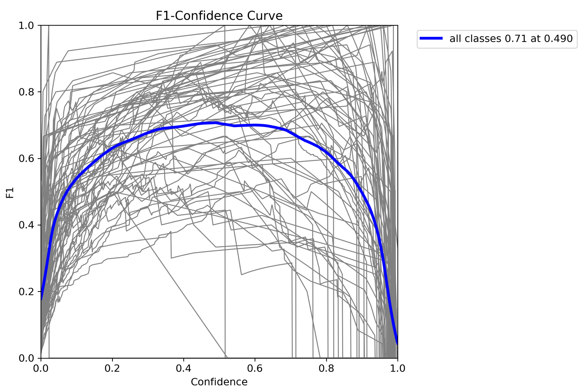

  ​	置信度阈值在0.490时效果最好 0.71

- PC_curve 精度置信曲线

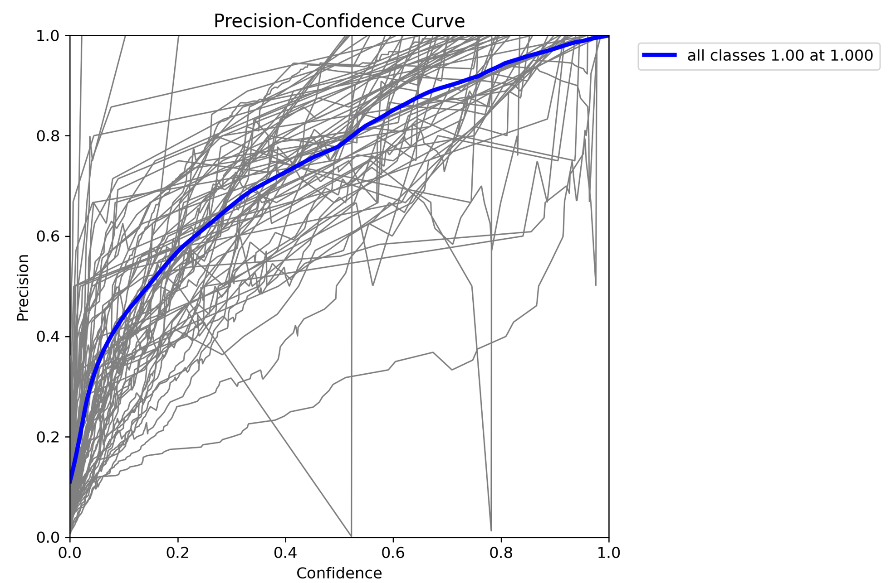

精确率指分类为正类别的样本中真正为正类别的比例，召回率指所有正类别样本中被正确识别为正类别的比例。这两者往往需要进行权衡。

**precision=（TP）/（TP+FP） （挑选正确的占挑选的比例，说明从所有挑选出来的样本找正确挑选的比例）**

**由图可知，置信度在1以上时，有较好的精确度1**

- PR_curve 精确召唤度曲线（PR曲线）

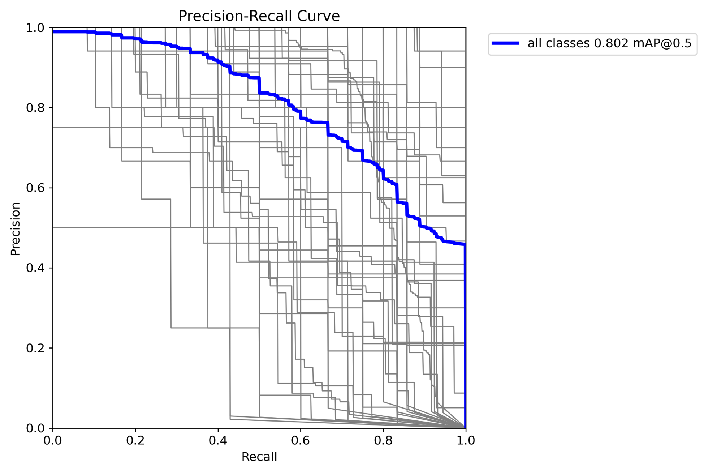

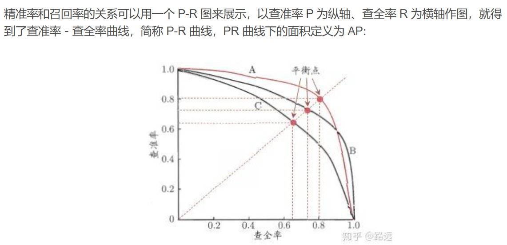

如何找到最好的阈值点呢？ 首先，需要说明的是我们对于这两个指标的要求：我们希望查准率和查全率同时都非常高。 但实际上这两个指标是一对矛盾体，无法做到双高。图中明显看到，如果其中一个非常高，另一个肯定会非常低。选取合适的阈值点要根据实际需求，比如我们想要高的查全率，那么我们就会牺牲一些查准率，在保证查全率最高的情况下，查准率也不那么低。

**结论：越靠近正方形的对角越好。**

- RC_curve 召回置信度曲线

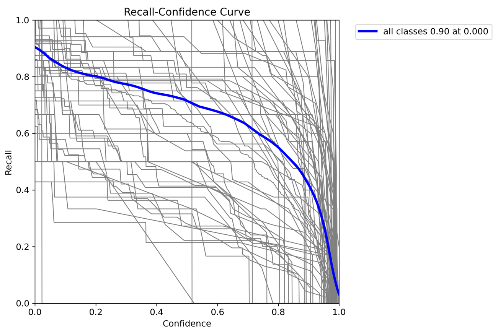

正样本预测正确占实际正样本的比例。
精确率和召回率是用于衡量二分类模型性能的指标。精确率指分类为正类别的样本中真正为正类别的比例，召回率指所有正类别样本中被正确识别为正类别的比例。这两者往往需要进行权衡。

R=（TP）/（TP+FN） （挑选正确占挑选正确+没挑选错误（漏报），说明正确挑选的占实际正样本的比例）

**由图可知：置信度大于0.8后，召回率快速下降，说明漏报快速增加**

- 训练过程图

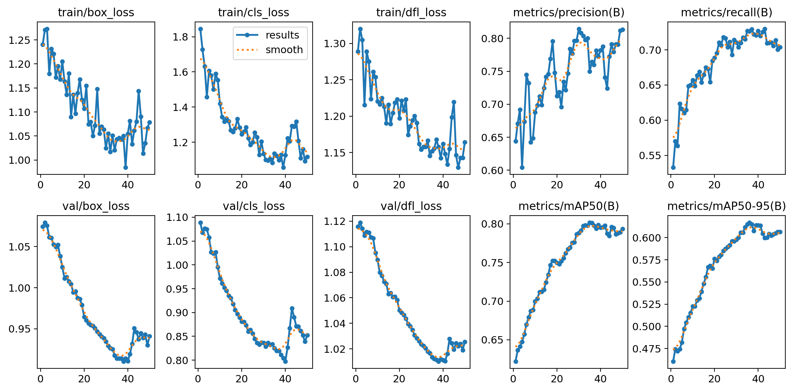

训练了50轮

yolov8的三个损失，分别是：

1. `box_loss`（边界框损失）：这个损失函数用于计算预测边界框与真实边界框之间的差异。YOLOv8使用IOU（Intersection over Union）作为度量，来衡量两个边界框之间的重叠程度。`box_loss`通过计算预测框与真实框之间的IOU，来衡量预测框的位置准确度，并将其转化为一个损失值。通过最小化`box_loss`，模型可以学习到更准确的边界框位置。
2. `cls_loss`（分类损失）：这个损失函数用于计算预测类别与真实类别之间的差异。YOLOv8使用交叉熵损失（Cross Entropy Loss）来衡量分类准确度。`cls_loss`通过比较预测类别分布与真实类别标签之间的差异，来计算分类的损失值。通过最小化`cls_loss`，模型可以学习到更准确的类别分类。
3. `dfl_loss`（特征点损失）：这个损失函数是YOLOv8中引入的自定义损失函数。YOLOv8使用了特征点来预测物体的方向和角度信息，`dfl_loss`用于计算预测特征点与真实特征点之间的差异。通过最小化`dfl_loss`，模型可以学习到更准确的物体方向和角度信息。

**上面一排是训练的时候的三个损失和精确度，召回率。**

**下面一排是验证 的时候的三个损失和精确度，召回率。**

- val_batch0_labels & val_batch0_pred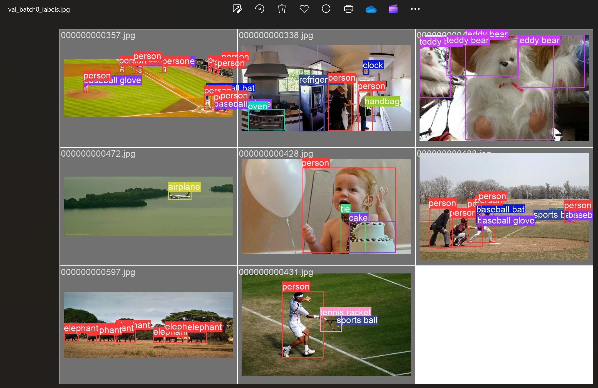

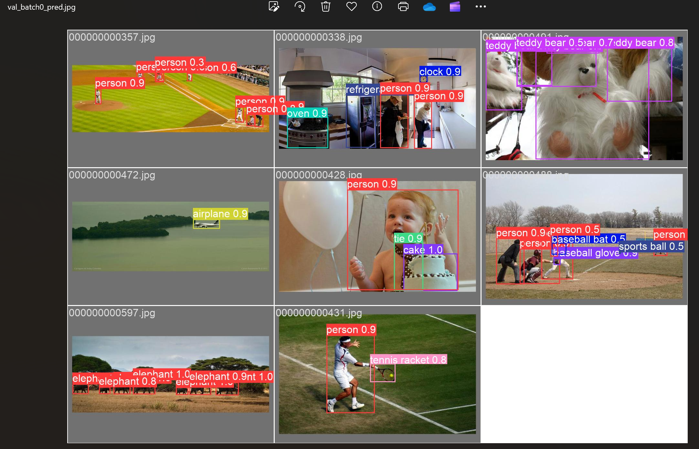

**标签框图1和预测框图2，由图可知，图2存在漏报**