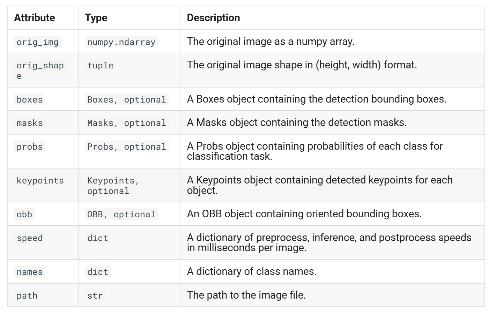
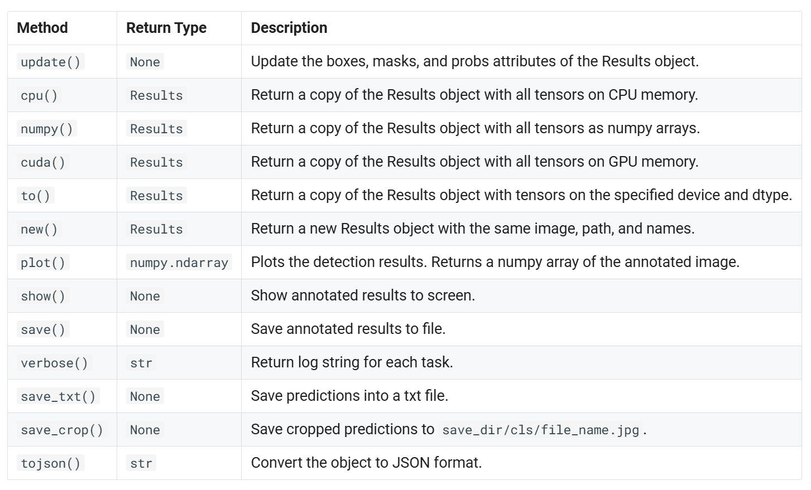

- [predict mode](#predict-mode)
- [Real-world Applications](#real-world-applications)
- [advantage](#advantage)
- [key feature](#key-feature)
- [Working with Results](#working-with-results)
  - [boxes](#boxes)

## predict mode

Ultralytics YOLOv8 offers a powerful feature known as predict mode that is tailored for high-performance, real-time inference on a wide range of data sources. 专为在各种数据源上进行高性能实时推理而量身定制

How to Extract the Outputs from Ultralytics YOLOv8 Model for Custom Projects.

## Real-world Applications

- manufacturing: Vehicle Spare Parts Detection 车辆零部件检测
- Football Player Detection
- People Fall Detection

## advantage

- versatility: Capable of making inferences on images, videos, and even live streams. 多功能性：能够对图像、视频甚至直播进行推理。
- performance: Engineered for real-time, high-speed processing without sacrificing accuracy. 专为实时、高速处理而设计，不会牺牲准确性。
- Ease of Use
- Highly Customizable

## key feature

- Multiple Data Source Compatibility 多数据源兼容。Whether your data is in the form of individual images, a collection of images, video files, or real-time video streams, predict mode has you covered.
- stream model: enable this by setting stream=True 使用流式传输功能生成内存高效的结果对象生成器
- batch processing 批处理 The ability to process multiple images or video frames in a single batch, further speeding up inference time. 能够在一个批次中处理多个图像或视频帧，进一步加快推理时间

## Working with Results

model(...)会返回一个结果对象，All Ultralytics predict() calls will return a list of Results objects:

Results objects have the following attributes:

Results objects have the following methods:

### boxes

- xyxy (torch.Tensor | numpy.ndarray): Boxes in [x1, y1, x2, y2] format. 
  - 框的起点和终点像素坐标
- conf (torch.Tensor | numpy.ndarray): Confidence scores for each box. 
- cls (torch.Tensor | numpy.ndarray): Class labels for each box.
- id (torch.Tensor | numpy.ndarray, optional): Tracking IDs for each box, if available. 
- xywh (torch.Tensor | numpy.ndarray): Boxes in [x, y, width, height] format, calculated on demand. 
  - xywh 中心坐标+宽高
- xyxyn (torch.Tensor | numpy.ndarray): Normalized [x1, y1, x2, y2] boxes, relative to orig_shape. 归一化之后的xyxy
- xywhn (torch.Tensor | numpy.ndarray): Normalized [x, y, width, height] boxes, relative to orig_shape. 归一化之后的xywh