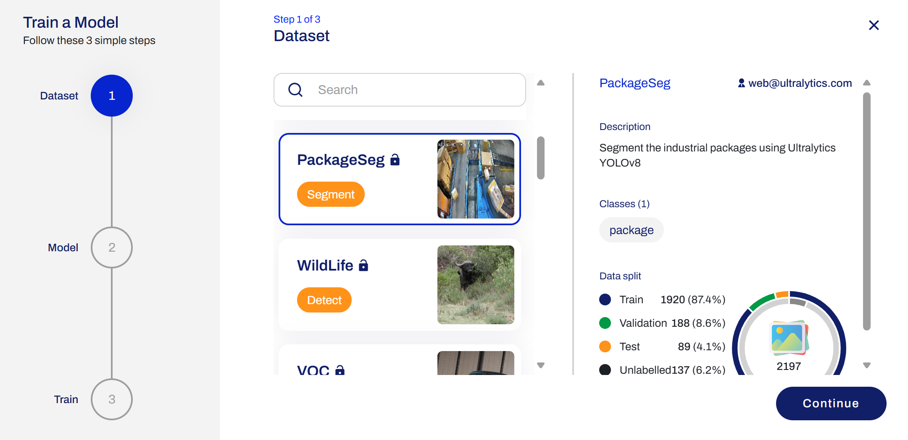
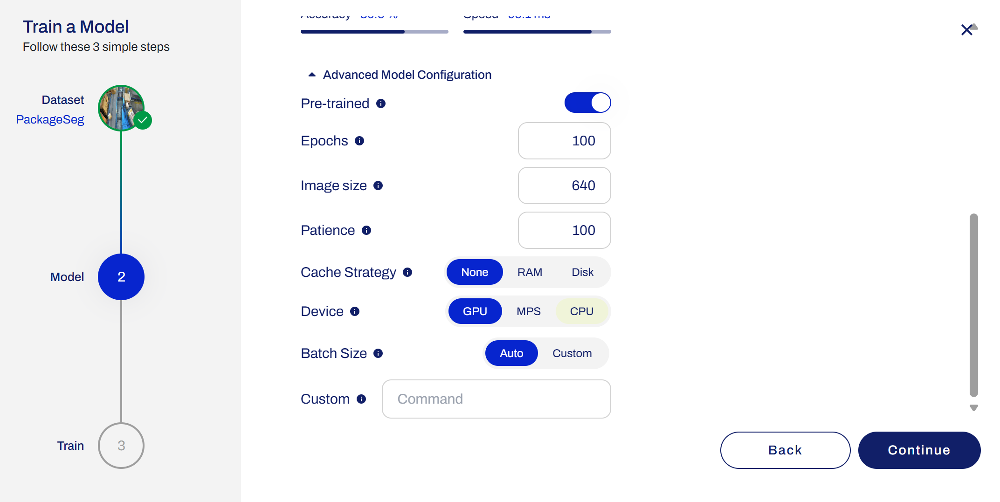
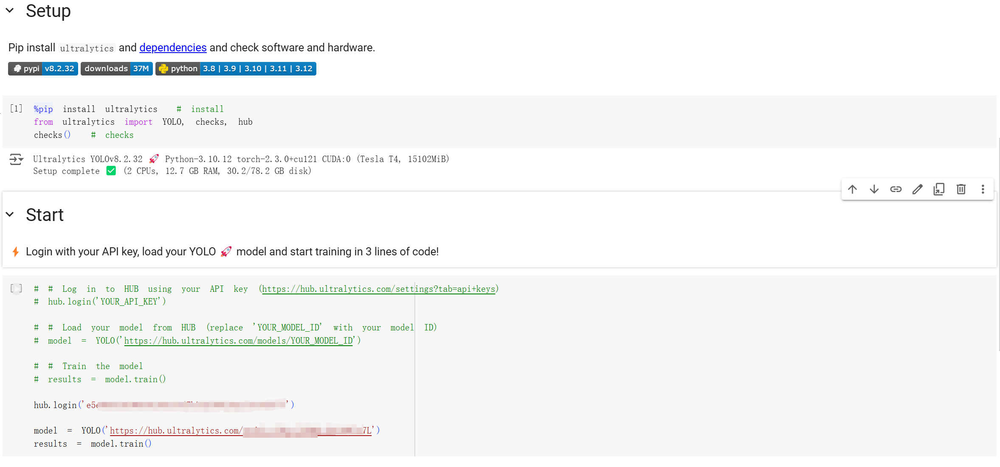
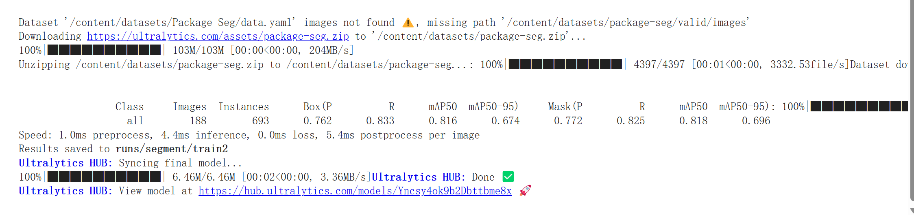
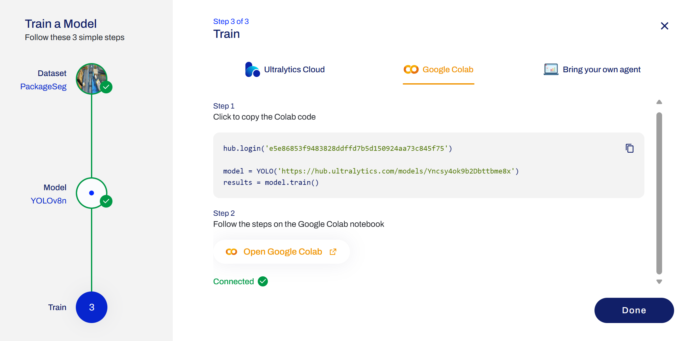
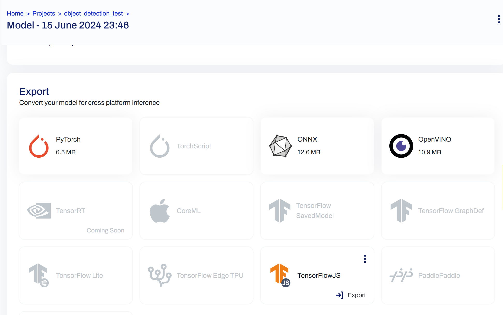

- [Online Tools](#online-tools)
  - [Ultralytics HUB](#ultralytics-hub)
  - [google colab](#google-colab)
  - [roboflow](#roboflow)

# Online Tools

## Ultralytics HUB

[Ultralytics HUB](https://hub.ultralytics.com/home?utm_source=github&utm_medium=social&utm_campaign=cloud_training_release)

- allowing user upload their dataset and train new YOLO model. it also offers a range of pre-train model
- offers dataset
- effortlessly previewed trained model
- deployed for real-time classification 实时分类, object detection, and instance segmentation tasks

- select online dataset and train model

## google colab

- train via [google colab](https://colab.research.google.com/github/ultralytics/hub/blob/main/hub.ipynb#scrollTo=eRQ2ow94MiOv)

- at the same time, you can view the 

- export

## roboflow

Roboflow是一款专为YOLOv8设计的自动化训练数据工具，它为YOLOv8提供了一种更便捷、更快速的方式来准备训练数据。它能够自动从开发者提供的原始图像数据中提取所需的信息，并将其转换为YOLOv8可以直接使用的格式。
